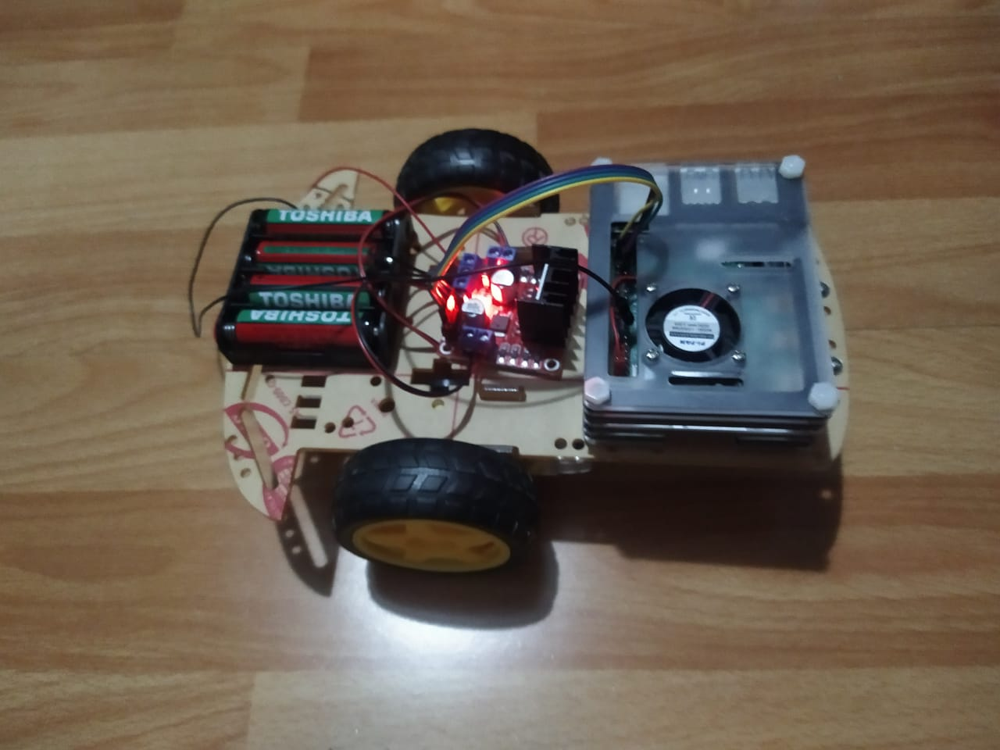

# Navegación Autónoma con Double DQN acelerado por CUDA

**Autores**

- Braulio Nayap Maldonado Casilla
- Sergio Daniel Mogollon Caceres
- Paul Antony Parizaca Mozo
- Avelino Lupo Condori
- Leon Felipe Davis Coropuna
- Luciana Julissa Huaman Coaquira

Este proyecto implementa un sistema de navegación autónoma basado en Aprendizaje por Refuerzo Profundo (Deep Reinforcement Learning), específicamente utilizando el algoritmo Double DQN.

El núcleo del proyecto reside en la optimización del entrenamiento y la inferencia mediante CUDA C++, ejecutándose sobre una plataforma NVIDIA Jetson Xavier. El sistema entrenado actúa como el "cerebro", enviando comandos de navegación en tiempo real a través de WebSockets a un robot físico controlado por una Raspberry Pi.

## Arquitectura del Sistema

El proyecto se divide en tres componentes principales que interactúan entre sí:

1. **El Cerebro (IA y CUDA):**

- Ejecutado en una NVIDIA Jetson Xavier.
- Implementa una Red Neuronal Profunda (DNN) escrita desde cero en C++ y acelerada con kernels de CUDA.
- Utiliza Double DQN para desacoplar la selección de acciones de la evaluación del objetivo, estabilizando el aprendizaje en el entorno de rejilla (GridWorld).
- Calcula la ruta óptima para evitar obstáculos (trampas/paredes) y alcanzar la meta.

2. **El Puente (Comunicación):**

- Un servidor intermediario basado en Node.js y WebSockets.
- Permite la comunicación bidireccional de baja latencia.
- Recibe los comandos de la IA ("Arriba", "Abajo", "Izquierda", "Derecha") y los difunde al controlador del robot.

3. **El Cuerpo (Robot):**

- Controlado por una Raspberry Pi.
- Actúa como cliente WebSocket, recibiendo las instrucciones del servidor.
- Ejecuta los movimientos físicos en los motores del robot para navegar en el mundo real.

## El Robot

El agente físico encargado de ejecutar las acciones aprendidas por el modelo:



## Instalación

Para comenzar a utilizar el proyecto, clone el repositorio en su máquina local o dispositivo Jetson Xavier utilizando el siguiente comando:

```bash
git clone https://github.com/i-am-sergio/robotics-project/

```

## Flujo de Trabajo

1. **Entrenamiento:** El modelo Double DQN se entrena intensivamente en la GPU de la Jetson Xavier utilizando el entorno simulado. Gracias a CUDA, los pasos de forward y backpropagation se paralelizan, reduciendo drásticamente los tiempos de cómputo.
2. **Inferencia:** Una vez entrenado, el modelo evalúa el estado actual del entorno en tiempo real.
3. **Transmisión:** La acción óptima decidida por la red neuronal se envía al servidor WebSocket.
4. **Actuación:** La Raspberry Pi recibe el comando y mueve el robot físicamente, completando el ciclo de navegación.

## Estructura del Proyecto

Este repositorio está modularizado para separar la lógica de entrenamiento, comunicación y control. A continuación se describe el contenido de cada módulo (la documentación técnica detallada se encuentra dentro de cada directorio):

- **DoubleDQN_CUDA:**
  Contiene el núcleo del proyecto en C++ y CUDA. Implementa los kernels de la red neuronal, el agente, el Experience Replay y el entorno. Genera los ejecutables de entrenamiento y el cliente que conecta la IA al WebSocket.
- **socket-server:**
  Servidor Node.js que gestiona las conexiones entre la Jetson Xavier (IA) y la Raspberry Pi (Robot), realizando el broadcasting de comandos de movimiento.
- **Instructions Sender:**
  Herramientas de diagnóstico en C++ que permiten probar la conectividad y el protocolo de comunicación sin necesidad de cargar todo el modelo de IA.

## Tecnologías Clave

- **Lenguajes:** C++11/14, CUDA, JavaScript (Node.js).
- **Hardware:** NVIDIA Jetson Xavier, Raspberry Pi 3/4.
- **Protocolos:** TCP/IP, WebSockets (RFC 6455).
- **Algoritmos:** Double Deep Q-Network (DDQN), Experience Replay, Stochastic Gradient Descent (SGD).

_Para detalles sobre compilación, instalación de dependencias y ejecución de cada módulo, por favor consulta el archivo README.md específico dentro de cada carpeta._

---

## Author

- **Braulio Nayap Maldonado Casilla** - [GitHub Profile](https://github.com/ShinjiMC)
- **Sergio Daniel Mogollon Caceres** - [GitHub Profile](https://github.com/i-am-sergio)
- **Paul Antony Parizaca Mozo** - [GitHub Profile](https://github.com/PaulParizacaMozo)
- **Avelino Lupo Condori** - [GitHub Profile](https://github.com/lino62U)
- **Leon Felipe Davis Coropuna** - [GitHub Profile](https://github.com/LeonDavisCoropuna)
- **Luciana Julissa Huaman Coaquira** - [GitHub Profile](https://github.com/lu0811)

## License

This project is licensed under the MIT License. See the [LICENSE](LICENSE) file for details.
